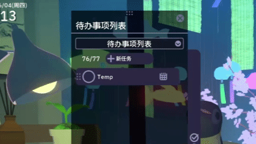

# Chill With You Blackboard Todo Importer

[English](README.md) | [简体中文](README.zh-CN.md)

A Blackboard Todo importer plugin for **Chill With You: Lo-Fi Story**.  
It imports tasks from Blackboard `Calendar > Due Dates` into the in-game Todo list, so deadlines can show up in a calmer and more natural place.

This project was built with AI assistance. AI helped with brainstorming, debugging, code organization, and documentation polishing; the project goals, testing process, and final implementation choices were based on my own workflow and use case.

---

## ✨ Features

- Reads due items from Blackboard `Calendar > Due Dates`
- Extracts task titles, course subject labels, and due times
- Sends tasks to the game plugin through a local HTTP endpoint
- Creates normal Todo items inside the game
- Uses stable IDs to avoid duplicate imports
- Supports manual JSON import
- Supports `F10` as a manual re-import hotkey
- Sends data only to `localhost`; nothing is uploaded to an external server

---

## 🔄 First-Time Refresh

After running the Chrome bookmarklet, imported tasks may not appear immediately.

Open the Todo panel and click the Todo list selector once to refresh the list.



---

## 📦 Project Structure

The project has two main parts:

```text
src/BlackboardTodoImporterPlugin.cs
```

The game-side BepInEx plugin. It receives tasks and writes them into the in-game Todo list.

```text
browser/blackboard-to-chill-importer.js
```

The browser bookmarklet script. It reads due items from Blackboard and sends them to the local game plugin.

Release packages may be organized into two folders:

```text
BepInEx/
Chrome/
```

- `BepInEx/` contains the plugin files. Copy this folder directly into the game root folder.
- `Chrome/` contains the bookmarklet install page and browser files.

---

## 🛠️ Installation

### Requirements

- Windows
- Steam version of **Chill With You: Lo-Fi Story**
- Chrome browser
- An already logged-in Blackboard session
- BepInEx 5.4.x or newer

---

### 1. Install BepInEx

1. Download the **BepInEx 5 x64** version.
2. Extract BepInEx.
3. Copy the extracted files into the game root folder.

The game root folder usually looks similar to:

```text
SteamLibrary\steamapps\common\Chill with You Lo-Fi Story
```

After copying the files, the folder should look similar to:

```text
[GameRoot]/
├── BepInEx/
├── doorstop_config.ini
├── winhttp.dll
└── Chill With You.exe
```

4. Run the game once.
5. Close the game and confirm that these files or folders were created:

```text
BepInEx/plugins/
BepInEx/config/
BepInEx/LogOutput.log
```

If they exist, BepInEx is installed correctly.

---

### 2. Install the Plugin

Download the latest release package from the Releases page.

If the release zip contains a `BepInEx` folder, copy that whole folder directly into the game root folder.

The game root folder should then look similar to:

```text
[GameRoot]/
├── BepInEx/
│   └── plugins/
│       └── ChillWithYou.BlackboardTodoImporter.dll
├── doorstop_config.ini
├── winhttp.dll
└── Chill With You.exe
```

If you downloaded only the DLL, place it into:

```text
[GameRoot]/BepInEx/plugins/
```

After starting the game, the log should include something similar to:

```text
Blackboard Todo Importer loaded.
Blackboard bookmarklet HTTP server listening on http://127.0.0.1:29472/blackboard-import
```

If not, check:

```text
BepInEx/LogOutput.log
```

---

### 3. Install the Browser Bookmarklet

Download the latest release package from the Releases page.

If the release zip contains a `Chrome` folder, open that folder first.

Open:

```text
Chrome/install-bookmarklet.html
```

Then drag the button below to the Chrome bookmarks bar:

```text
Blackboard -> Chill Todo
```

If dragging does not work, create a Chrome bookmark manually and paste the contents of:

```text
Chrome/blackboard-bookmarklet.txt
```

into the bookmark URL field.

---

## 🚀 Usage

1. Start **Chill With You: Lo-Fi Story**.
2. Open Blackboard `Calendar > Due Dates` in Chrome.
3. Click the `Blackboard -> Chill Todo` bookmark.
4. The browser will show the detected tasks in a confirmation popup.
5. Confirm the popup to send the tasks to the game plugin.
6. Open the in-game Todo panel to check the imported tasks.

Sometimes the game UI may not refresh immediately. You can try:

- Reopening the Todo panel
- Clicking the Todo list selector/list once
- Waiting a few seconds
- Restarting the game

---

## 📄 Manual JSON Import

The plugin also supports manual JSON import.

File path:

```text
[GameRoot]/BepInEx/config/blackboard_tasks.json
```

Example:

```json
[
  {
    "id": "example-assignment-id",
    "title": "Example Homework",
    "due": "2026-07-15T23:59:00"
  }
]
```

After placing the file, press:

```text
F10
```

inside the game to import it manually.

---

## ⚙️ Configuration

The plugin automatically creates this config file:

```text
[GameRoot]/BepInEx/config/com.local.chillwithyou.blackboardtodoimporter.cfg
```

Common settings:

```ini
[Import]
AutoImportOnStart = true
Hotkey = F10
HttpPort = 29472
```

Settings:

- `AutoImportOnStart`: whether the plugin should try to import automatically when the game starts
- `Hotkey`: manual import hotkey
- `HttpPort`: local HTTP endpoint port

---

## 🧪 Building From Source

To build the plugin yourself, run:

```powershell
.\build.ps1
```

If the script cannot find your game folder, pass it manually:

```powershell
.\build.ps1 -GameRoot "<GameRoot>"
```

The built DLL will be placed in:

```text
bin/Release/
```

Copy the DLL into:

```text
[GameRoot]/BepInEx/plugins/
```

Then restart the game.

---

## 🔒 Privacy

This tool only reads the Blackboard page that is already open in your browser.

The extracted task data is sent only to the local address:

```text
http://127.0.0.1:29472/blackboard-import
```

Nothing is uploaded to an external server.

Do not commit real personal task exports such as:

```text
blackboard_tasks.json
```

or other exported private payloads to a public repository.

---

## 📝 Notes

This is a small personal utility project. It helped me practice:

- BepInEx plugin development
- Runtime data modification in a Unity game
- Browser scripting
- Local HTTP communication
- JSON data handling
- Debugging and organizing a complete small tool

Possible future improvements include:

- Better Blackboard page parsing
- More reliable in-game UI refreshing
- Clearer error messages
- A small settings UI

---

## 🔎 Search Keywords

Blackboard Todo Importer, Blackboard assignment importer, Blackboard homework importer, Blackboard due date importer, Blackboard task sync, Blackboard calendar due dates, Chill With You plugin, Chill With You Todo importer, Chill With You homework tracker, BepInEx plugin, Unity game plugin, student productivity tool, assignment tracker, homework tracker.

---

## ⚠️ Disclaimer

This project is for learning and personal use.  
Different versions of the game, BepInEx, or Blackboard page layouts may cause the plugin to stop working.

Back up your game saves and configuration files before using it.  
If the game or Blackboard page changes, the plugin may need updates.
